# Intro
I am **Subham Maity**
I love Programming. One of the aims I had when I started ```CodeXam``` was to make learning programming easy.
## Help us improve this guide - **Fork, Pull Requests, Shares and Likes are recommended**!
# [You can follow the Google Doc](https://docs.google.com/document/d/190sAY4DDUiqnZRU8ZprLMTd_6e3r3i9aOdA-26l5IYo/edit)
# [For Detail Explanation Follow This video Playlist ](https://www.youtube.com/watch?v=q933Vpo-Naw&list=PL24H0nY4FDEmh5e4WMgyL6zxOg64JNXdF&ab_channel=CodeXam)


1. **Cloning a Remote Git Repository from GitHub**

We are going to learn about Cloning a Git Repository from Github. So let’s get started.

**Steps:**

- Open Browser and go to the GitHub page of that git repository.
- Let’s say for example we are cloning Tensorflow’s repo.
- Let’s navigate to the official Github repo of [Tensorflow.](https://github.com/tensorflow/tensorflow)
- Now click on code or download and copy the URL.
- Open git bash and type “git clone (copied URL)”
- Example: “**git clone [https://github.com/tensorflow/tensorflow.git**”](https://github.com/tensorflow/tensorflow.git)**
- Wait for the git clone to complete, this will only take a little bit of time for the first time.
- Now you can change the files locally, track them and commit them locally.

Change Something in The Tensorflow File

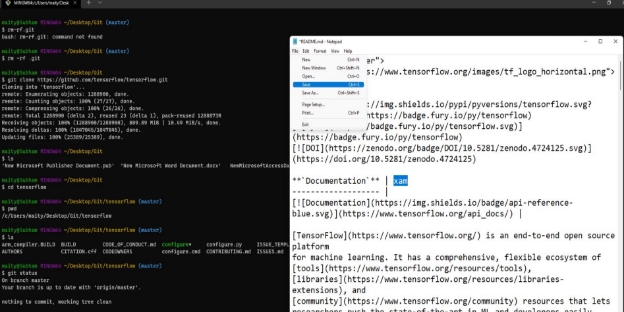

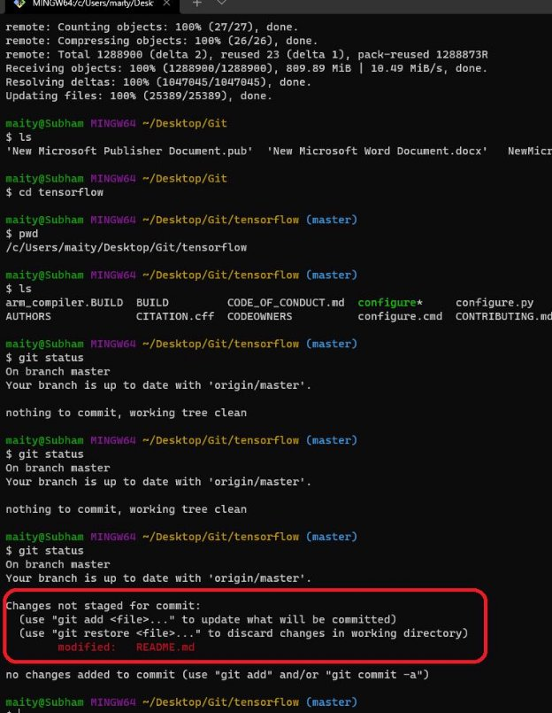

For Stage Those Changed Files: git add –a

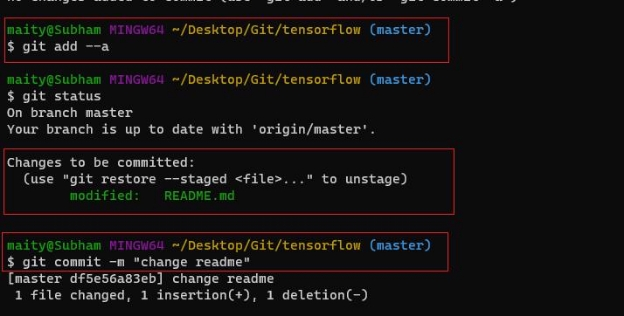

For Check All The Changes: git log

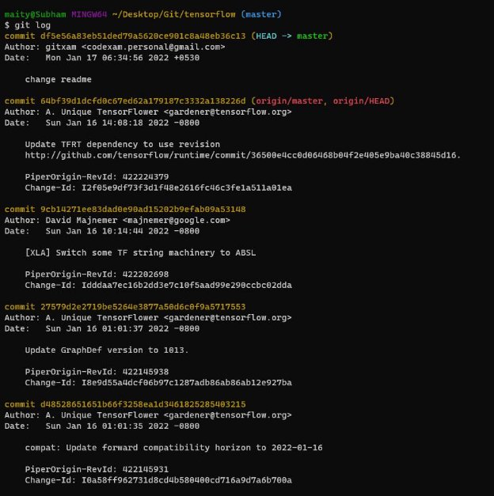

**Note:**

rm -rf .git command **deletes directory forcefully(rm space -rf space .git)**

ls **(content list)** cd **(change directory)** pwd **(present working Directory)**

2. **Git: File Status Lifecycle**

Today we are going to learn about the File status life cycle. So let’s get started. When you start to track files on an empty repository every file stays in the untracked stage. Which means we have not staged these files. So after adding the files by typing “git add --a”, every file moves into the unmodified section. Now if we change a few files they will be moved to modify and staged. Now what happened here is, we have added every file to the tracker, and now as we modify files will be moved to the modified phase. Now if we run the add command then the files which were in the modified stage will be staged.


- Let’s open a new folder and initialize it as a git repo by opening Git bash and typing “git init”
- 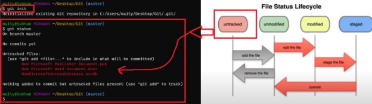
- Now let's add the files by using “git add --a”.
- 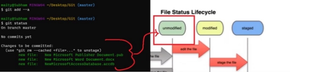
- Now every file has been staged.
- Now if we change 1 file and do “git status” then you will see that the file we changed is

present both on the staging area and untracked area. Because you have staged the file

and those are meant to go to the commit until the user stages other changes. So only those will go to the next commit which is staged. The untracked files will be ignored unless the user adds them to the stage.


**Note:** [Space Problem or Name Problem ( git-add-a-folder-with-spaces-in-the-name)](https://stackoverflow.com/questions/27393010/git-add-a-folder-with-spaces-in-the-name)

3. **What is GitIgnore?**

**What is gitignore?**

.gitignore is a file that tells git which files (or patterns) it should ignore. It's usually used to avoid committing unnecessary files from your working directory that aren’t used such as compilation products, temporary files, etc.

**Now Let’s see how to add .gitignore to your repo and ignore files**

- Let’s start by creating an unnecessary file.
- Open git bash on that folder and type “touch file.log”
- 
- Now you will see file.log will be created.
- Now we will gitignore this file.
- Again open git bash and type touch .gitignore.
- Now if you do “git status” it will return you 2 untracked files, .gitignore and file.log.
- 
- Now let’s open  .gitignore file using notepad, type there file.log and save and close it.
- 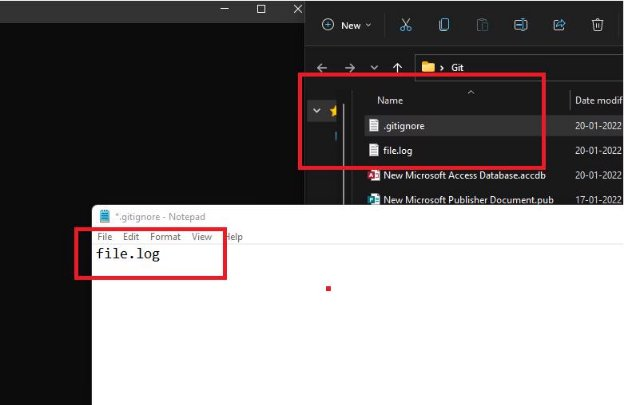
- Now if we do “git status”, it will return only 1 file,which is .gitignore. Because the other

one will be ignored.


- Now type “git add --a” to add gitignore to the staging area.

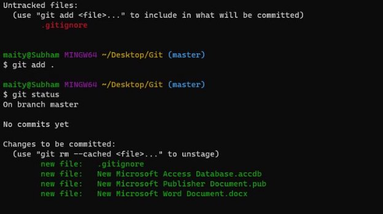

- Now let’s commit by typing “git commit -m “added .gitignore””.
- Done! We have successfully created .gitignore for our repo.

**Ignoring Specific Extension files:**

- Create .gitignore the same as the last one.
- Now open it using notepad and type there “\*.extension”to ignore. (example for ignoring .log files : “\*.log”)
- 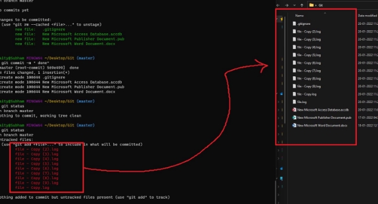
- 
- Now save and exit the notepad and commit the gitignore to your repo.
- 

**Ignoring Folders:**

- Now we will ignore a whole directory.
- 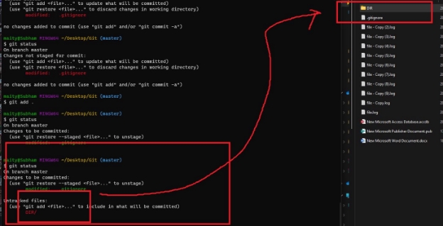
- Create and open .gitignore and type there the directory name followed by “\”. (example:

dir/ )

- 
- If you create a blank folder, git will automatically ignore it.


4. **What is Git Diff?**

**What is Git Diff?**

Diff command is used in git to track the difference between the changes made on a file. Since Git is a version control system, tracking changes is a very vital part to it. Diff command takes two inputs and shows the differences between them. These inputs can be branches, working trees, commits and more. Now Let’s learn about Git Diff in these simple steps.

- Let’s start by staging one file.
- Open git bash on that folder and add that file into the staging area by typing “git add --a‘.
- Now if you do “git status” it will show that the file has been staged.
- Now if you modify the file and do “git status”, it will show that the file has been modified and not staged for commit and also it will show that the file is ready to be committed. Why does it happen? It happens only because we have staged the file earlier so it has moved to the staging area and is ready to be committed, and when we have modified it, it also shows up on the modified area. We have seen this happen earlier too.
- Now let’s compare the working directory with the staging area so we can see those changes.
- Type “git diff” and see the output.
- The output should look like this.


- The red line shows that the lines are modified or deleted on the staging area and the green shows things added on the working directory.
- Now if we do “git add --a” and do git diff it will show nothing because we have staged every change.
- 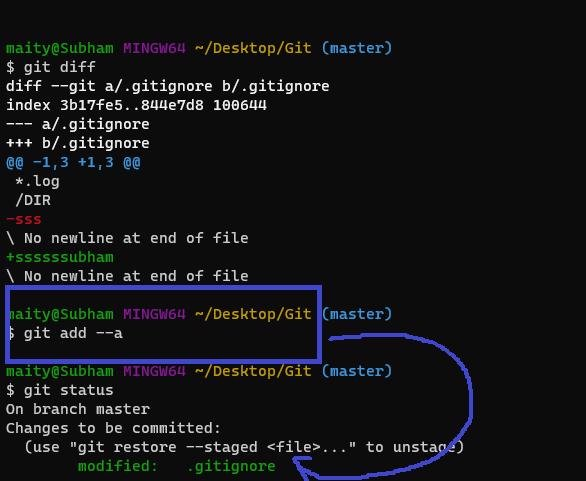

**Git Diff in previous commits:**

- If we use “git diff --staged” it will compare every commit with your working directory.
- 
5. **Skipping The Stage Area ?**
- Let’s modify a file in our directory.
- Now open git bash in that directory.
- If we do “git status” it will show us that the file has been modified but not has been staged.
- 
- Let’s create a new file on that directory and do “git status”
- It will show us that the tracked file (the file we modified earlier) has been modified but

not added to the staging area and the new file is untracked.

- 
- Now let’s skip the staging and directly commit.
- NOTE: Only tracked files can skip the staging area, to add your file to tracker type “git add --a” or “git add filename.extension”.
- Now let's skip the staging by typing “git commit -a -m “Commit Message””.
- 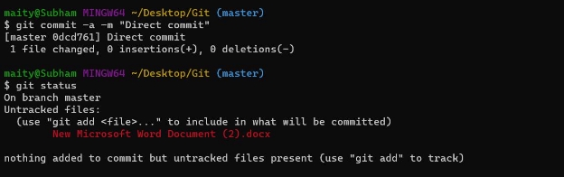
- Now if we do “git status” it will show that the working directory is clean. Which means

we have successfully skipped the staging area and committed the changes.

- 
6. **Moving and Renaming Files?**

Today we are going to learn how to move and rename files in git. We can also do it manually but then, we need to stage those changes using git bash. That is why we are going to do it inside git. Git will automatically stage it after moving/deleting/renaming that file. So let’s get started. **Deleting Files:**

To delete files using git we need to use this command: “”git rm filename.extension”. It will delete the file and if you do “git status” now it will say that the file has been deleted and staged. Now we can commit it by using the “git commit -m “commit message”” command.


**Renaming Files:**

To rename file we need to use this command : “git mv filename.extension renamefile.extension”. It will rename the file from filename.extension to renamefile.extension. And it will also get automatically staged by git. All we need to do is commit.


**Untracking Tracked Files:**

To untrack a specific file we need to use the “git rm --cached file.extension” command. It will remove that file from the tracker and it will become an untracked file.


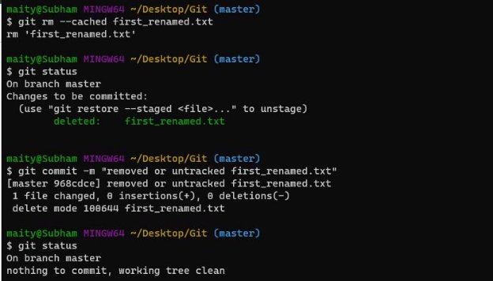

**7.Git Log: Viewing & Changing**


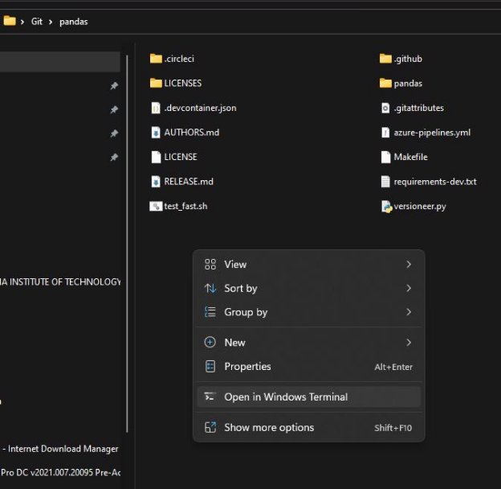

**Commits History:**

To see the commits made on the git repo, we need to type “git log”. After typing this you can see the commits that have been made on the repo. To exit we need to type “q” on our keyboard and press enter.


**Diff in Commits:**

To see the Diff in a commit we need to use “git log -p”. It will show what has been changed on a commit. To see specific no commits with changes we need to use “git log -p -2”(for seeing the last 2 changes).

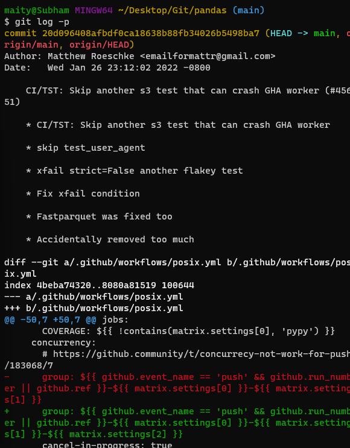

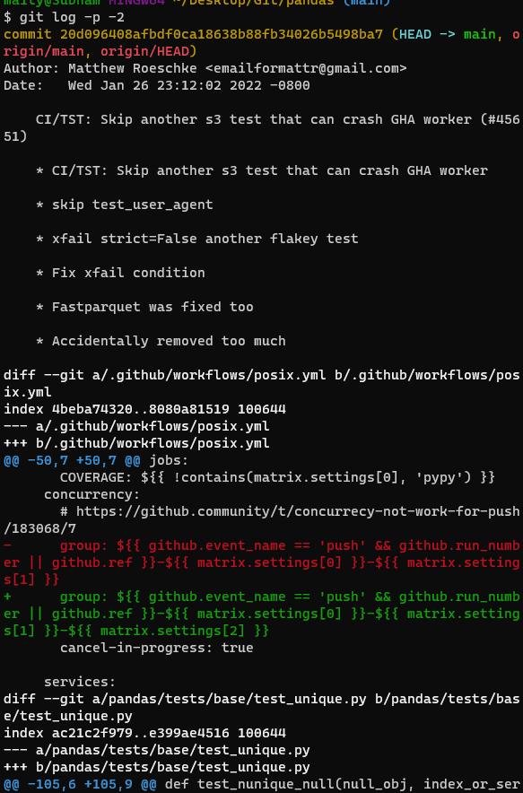

**Brief Summary:**

Also we can get a brief summary of commits by typing “git log --stat”.

If you want to see the commits on one line then type “git log --pretty=oneline ”.


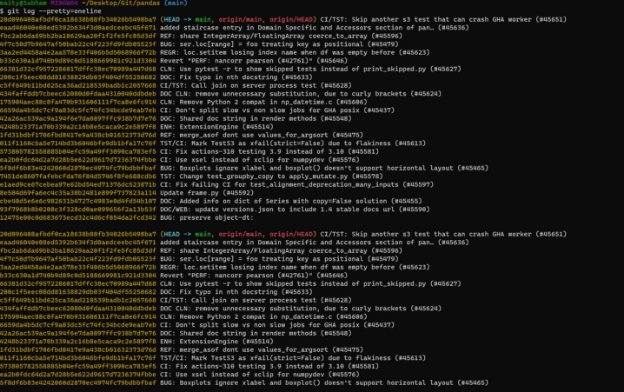

**Customized Commit Output:**

If you just want to see the commits and The author then use “git log --pretty=short”. And if you want a little bit more info like who is the committer, commit message, then use “git log --pretty=full”.

If you want to filter commits by time, then use this command,“git log --since=2.weeks”. To see the last 2 months of data type “git log --since=2.months”.

git log --since=2.days

We can format the output by using the formatting  codes provided in G[it’s w](https://git-scm.com/)ebsite. For an example we can use this format to print just the author name and the hash : “git log --pretty=format:"%h -- %an"”. ([Details)](https://git-scm.com/docs/pretty-formats)

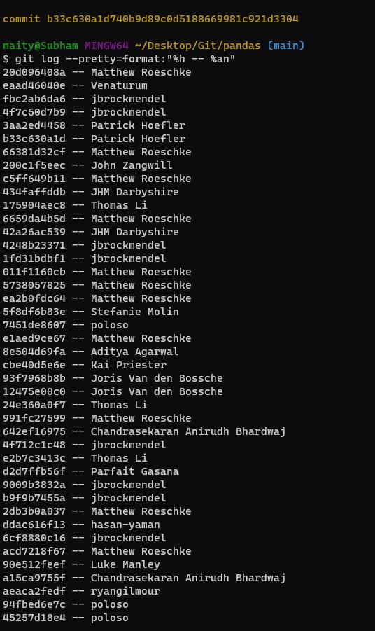

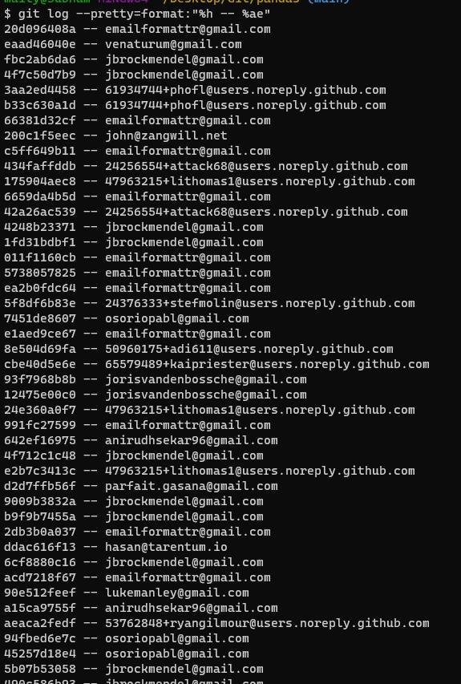


**Changing A Commit Message:**


Now to change a commit. So, to change the most recent commit we need to type “git commit --amend” and press enter. Then an editor will open where you can change the commit message. All you need to do is change the message and then you need to close it by pressing i then esc key then type “:wq” to exit the editor. Now you have successfully edited the commit.

you can easily configure git to use another editor. Fire up a command line and enter: git config --global core.editor notepad


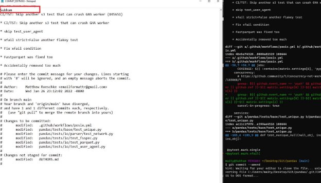


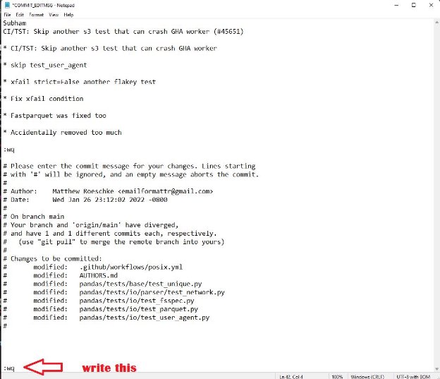


**8.Unstaging & Un-modifying Files In Git**

Let’s say we have few files in our git repository and we have staged them. Now for some reason we want to unstage a file. Now how to do that? It is super easy. Let’s see.

**Unstaged:**

- To unstage a file use “git restore --staged file.ext”. It will unstage the file and you can verify it by using “git status”.

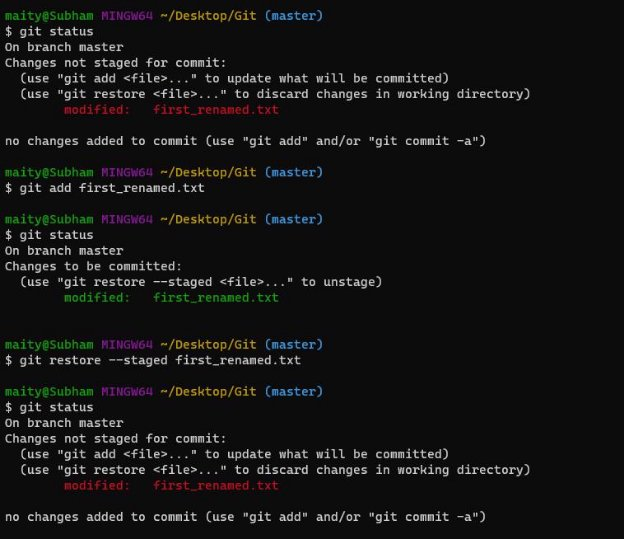

**Git Checkout / Restore Last commit State:**

- Now let’s say we have modified the unstaged file and made some changes which were not necessary. Now the program is not working. So we have to restore that file to its previous state where it was working. To do it use “git checkout -- file.ext”. Now git will restore that file to its last commit state.


Security features

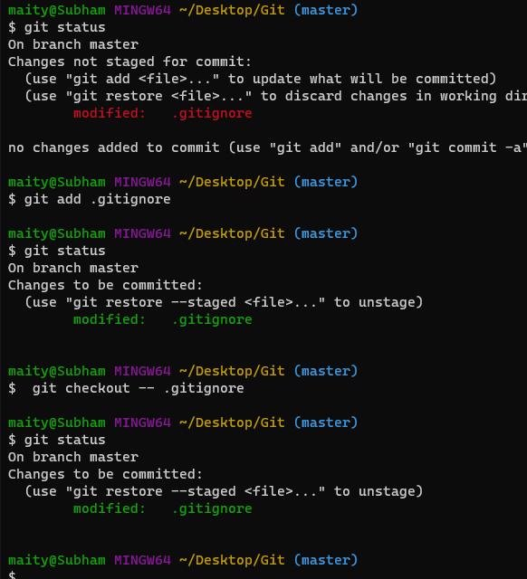

**Git Checkout F:**

- To restore your entire working directory to the previous commit use “git checkout -f”. It will restore your entire directory to the last commit.


**9.Remote Repositories**

Let’s start by going to Github’s official website and creating an account. **Create Github Account:**

1. Go to https://github.com/join.
1. Fill out the form.
1. Click Create account.
1. Complete the CAPTCHA.
1. Click Choose on your desired plan.
1. Verify your email address.
1. Confirm your plan.
1. Select your preferences.

After you have created your account you need to go to the home page and click on the create a new repository option.


Now give your repository a name and description. Now click on create repository.

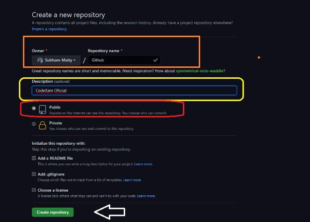Now it will show you a page for quick setup. Now let’s make our local repository a remote repository.


**Steps:**

- Go to your local directory and open git bash there.
- Now we have 2 options, 1: If we have not created a git repository in our system then follow the first method,   2: We have a git repo in our local system we just want to push it to the remote system then follow the method 2.
- We are following Method 2 Here.
- So let’s copy the code on git’s website which looks like this: “git remote add origin git@github.com:yourusername/repositoryname.git”and paste it to the git bash and press enter. (Shift+Insert Key For paste)


- Now we will paste the second command which pushes the files onto the remote server which is “git push -u origin master”.


- It will give you an error that access is denied. Now let’s tackle this.
- To fix it, go to your account settings on github, then SSH and GPG keys. Then click on the new SSH key, add a title. Now for the key, open git bash and follow the simple steps.

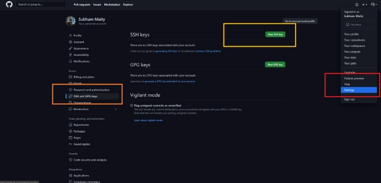

- On git bash type the following edit your email and press enter: “ssh-keygen -t rsa -b 4096 -C "your\_email@example.com" ”
- Now just simply press enter 3 times.

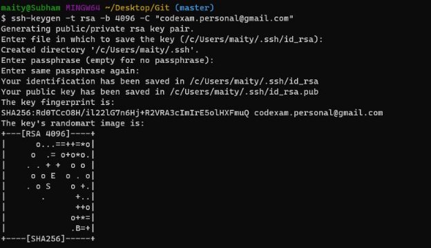

- Now run this command “eval $(ssh-agent -s)”.
- Now run this “ssh-add ~/.ssh/id\_rsa”.


- Now on git bash type this to reveal your key “tail ~/.ssh/id\_rsa.pub”.
- Now it will show you the ssh key. Just simply copy it.

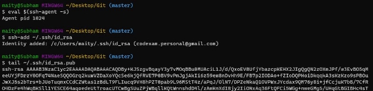

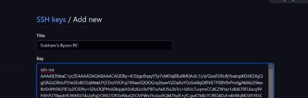

- And now let’s head back to the github SSH key page and paste the key to the key field, press add ssh key. And done!
- Now if you run “git push -u origin master”it will run and push your files to github.
- Now you can make changes on your local git repo and push the changes to the remote repo swiftly.

**Added a file and modify this and want to add this in our repo**


**10.Setting Alias**

**What is Alias?:**

Alias is a term which is associated with shortcuts in Git. It shortens the long commands to increase efficiency. So let’s see how to set up an alias.

**Setting Up Alias:**

- Open git bash and now type this command to set up an alias for “git status”.
- Type “git config --global alias.st status” and press enter. Now what it means is if we type “git st” it will give us the output of “git status”.

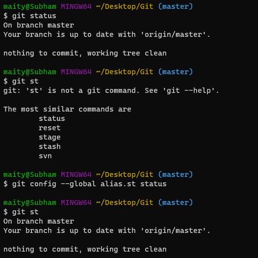

- Let’s do another one.
- git config --global alias.ci commit


- Now type “git config --global alias.unstage ‘restore --staged --’ ”.
- Now if you type “git unstage” it will work as “git restore --staged --”.

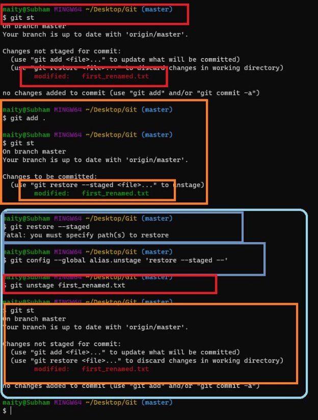

- We can set up as many aliases we want. Like we can create an alias for seeing the last commit done by the user.
- To do that type “git config --global alias.last ‘log -p -1’ ”.


- Now if we type “git last” it will show us the last commit done by the user.
**11.Creating Switching Branches**


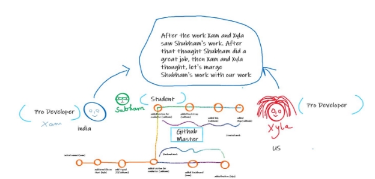


**What is Branch?**

Branch is a way to add new features or modification to the software and not affect the main part of the project. We can also say that branches create another line of development in the project.

**how to create and switch to a branch:**

- Open Git Bash on your local repository.
- Let’s create a branch by typing “git checkout -b branchname”.


- Now if you modify the files in the repo and do “git status” it will show you “on Branch branchname” which means you are changing files on the branch you have created.


- Let’s stage these files by using “git add .” and commit these changes by typing “git commit -m “commit message” ”.

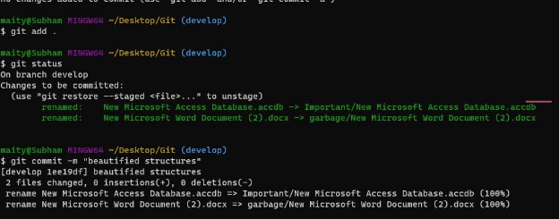

- Now if you do “git checkout master” then you will see that the files on your repo will revert to the master branch where we haven’t made any changes.

Before Switching the master branch


After Switching the master branch

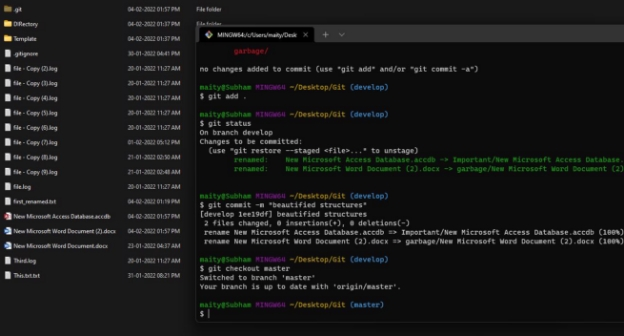

Before After GIF Footage


- Now if we do “git checkout branchname” we will switch from master branch to our newly created branch where we have modified files.

So this is how you create and switch to different branches.

**Revision**

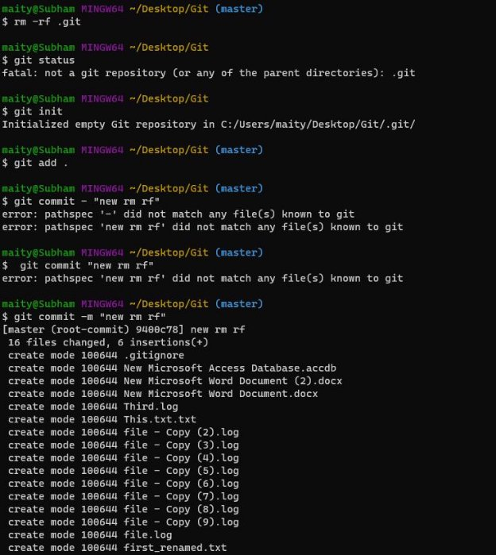


**Switching(Live Example) Video**


**12.Branching & Merging a Production Grade Project**

Today we are going to learn how to merge branches in Git. So let’s get started.

*Note: This is a recap video of everything we have done so far in this series. Also I have explained merging branches in this video. If you want to recap everything and then want to learn git merge, then watch the complete video. And if you just came to learn merging see down below.*

**Let’s see how to merge branches:**

- Open Git Bash on your local repository.
- Let’s create a branch by typing “git checkout -b branchname”.
- Now if you modify the files in the repo and do “git status” it will show you “on Branch branchname” which means you are changing files on the branch you have created.
- Let’s stage these files by using “git add .” and commit these changes by typing “git commit -m “commit message” ”.
- Now if you do “git checkout master” then you will see that the files on your repo will revert to the master branch where we haven’t made any changes.
- Now if we do “git merge branchname” it will merge those branches.
- Now we just need to stage and commit those changes by typing “git add .” & “git commit -m “commit message” ”.

**13.Resolving Merge Conflicts**

**When Merge Conflicts happen?**

When you merge branches that have competing commits, and Git cannot decide which changes to incorporate in the final merge, that's when merge conflicts happen.

**Resolving Conflicts:**

There are many ways to resolve conflicts on Git Merge. But we are going to use the easiest one. By using VSCode. Just Install VS Code in your system and open those files who have conflicts, and you will see 2 options: Current Change and Incoming change. Just like this.


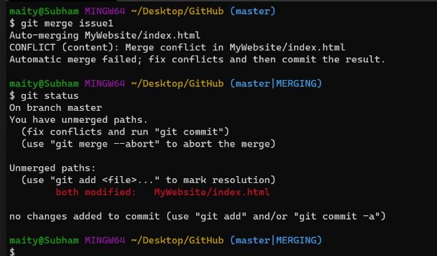

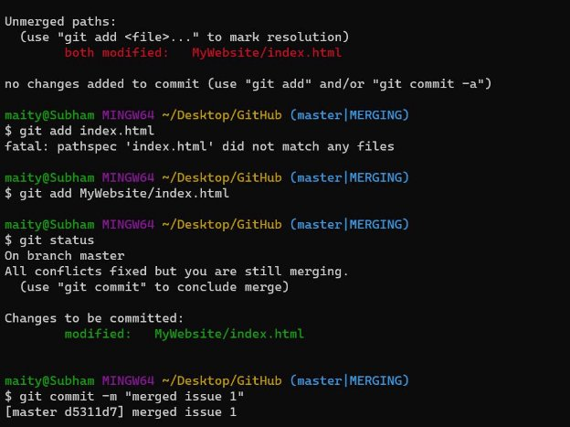

Just choose Accept Incoming change. Save the file and commit the files by typing “git add .”, and “git commit -m “message” ”. Now you have successfully merged 2 branches.


**Branch Management:**

We can create many branches in our repository and work in them. We also need to manage them. So let’s see few commands for managing branches in Git:

- To see all the branches you have created you will need to use this command : “git branch” and the current branch will have “\*” in front of the branch.
- To see Branches and that branch’s last commit along with it’s message type “git branch -v” and press enter.
- If you want to see which branches were merged then use “git branch --merged” and those that were not merged use “git branch --no-merged”.
- To delete a branch we need to use “git branch -d branchname”. Note that this command will fail if the branch we are deleting has not merged to the main branch. To tackle this error we will use “git branch -D branchname”, it will delete the branch even if it's not even merged yet.

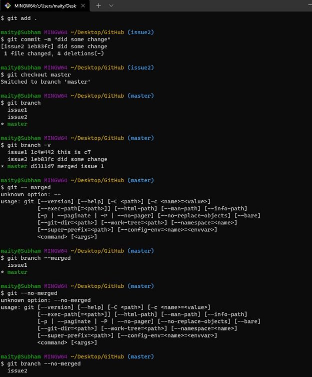


**14.Git Branching Workflow in Production**

When people usually use git they create branches and primarily they create 2 types of branches. **Long Running Branches:**

A long-running branch is a branch under active development that is not merged to the main branch for a long time. The main branch might be, for example, master or develop.

**Topic Branches:**

Topic branch is a short lived branch which was created for a single particular feature or related work. Topic branches can be deleted after the particular feature is added to the project. **Example:**

Let’s assume you were working on a project where you have committed C1 on the master branch and then an issue has arised and to solve that issue you have created a new branch

called issue and you have committed C2 and you came back to master to complete the work and committed C3 on master and went to the issue branch and committed C4, C5 and C6. When you were on C4 you came across another new issue and to fix that you have again created another new branch called Issue1 V2 and committed C7, C8 and C11 where you have solved that issue. After that you came to the Master branch and committed to C9, C10 and you got an idea. To implement the idea you created another branch named IDEA and committed C12 and C13. Now you want to Merge IDEA on to Master. Also you want to commit Issue1 V2 too. Now you have merged C11 of Issue1 V2 branch and C13 of IDEA branch and created a commit named C14 which is your master branch.

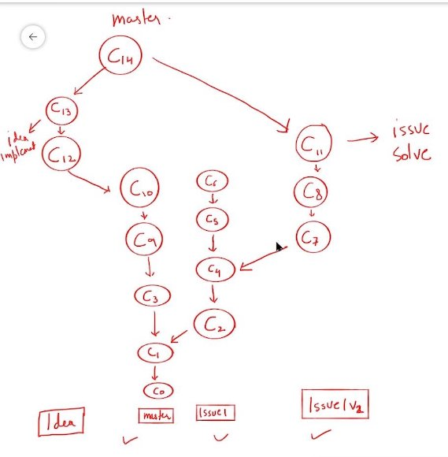

**15.Git Branching Workflow in Production**

When people usually use git they create branches and primarily they create 2 types of branches. **Long Running Branches:**

A long-running branch is a branch under active development that is not merged to the main branch for a long time. The main branch might be, for example, master or develop.

**Topic Branches:**

Topic branch is a short lived branch which was created for a single particular feature or related work. Topic branches can be deleted after the particular feature is added to the project. **Example:**

Let’s assume you were working on a project where you have committed C1 on the master branch and then an issue has arised and to solve that issue you have created a new branch

called issue and you have committed C2 and you came back to master to complete the work and committed C3 on master and went to the issue branch and committed C4, C5 and C6. When you were on C4 you came across another new issue and to fix that you have again created another new branch called Issue1 V2 and committed C7, C8 and C11 where you have solved that issue. After that you came to the Master branch and committed to C9, C10 and you got an idea. To implement the idea you created another branch named IDEA and committed C12 and C13. Now you want to Merge IDEA on to Master. Also you want to commit Issue1 V2 too. Now you have merged C11 of Issue1 V2 branch and C13 of IDEA branch and created a commit named C14 which is your master branch.


**16.Pushing Git Branches To Remote Repositories | Git Tutorials**

So let’s open git bash and run “git status” so see if you have any files to track and “git log” to see what you did on your last commits. Also check the branches you have in your repo by typing “git branch ”. Now let’s go to github.com and login using our username and password. After that click on New repository, and Give a name and description to your repository and press Create repository. Now look for the “Push an existing repository from the command line” tab and copy the first command which looks like this: “git remote add origin git@github.com:username/reponame.git”. Now come to the git bash and paste this command. Now if you do “git remote -v” it will show you that Origin has been added. Now Let’s push our code by typing “git push -u origin main”. Make sure that you have staged and committed your files. When you press enter after the command it will open the github login page, and you just need to login using your same github account and press login.

Now we will push our other branches to github. First let’s switch the branch by typing “git checkout branchname”. And if we now type “git push origin branchname” and press enter, it will push that branch to github and we can check that on github.

We can also merge our branches to the main branch and push the changes. We need to switch

to the main branch first by typing “git checkout main” Now we will merge the branch by typing “git merge branchname” and merge it. Now we will delete the unnecessary branch by typing “git branch -d branchname”. Now if we do “git status” it will show us only the main branch. And now we will push the changes by typing “git push -u origin main”. Now also remove the branch from remote repository too by typing “git push -d origin branchname”. And now if you check on github you will see that the branch has been deleted.

**Adding Two Android Project in my repo and making a branch also faced some issues how i solved this in git bash complete code is here**

[**Full Image Link**](https://drive.google.com/file/d/1CtJtHa2scd5s3cLAkFZ-h03mpOrJ11Ef/view?usp=sharing)


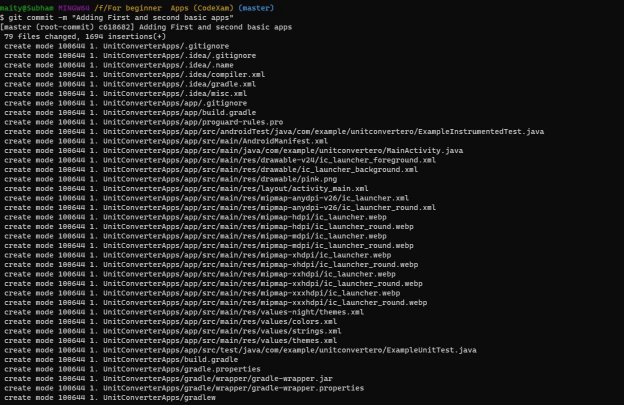

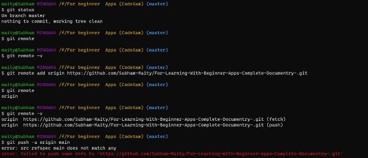

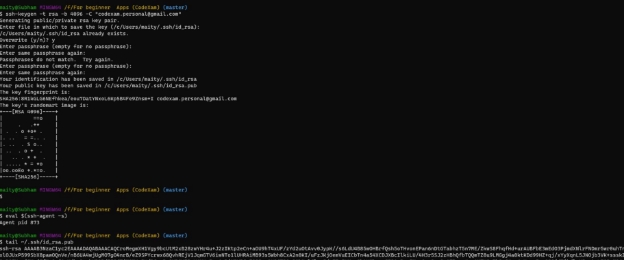

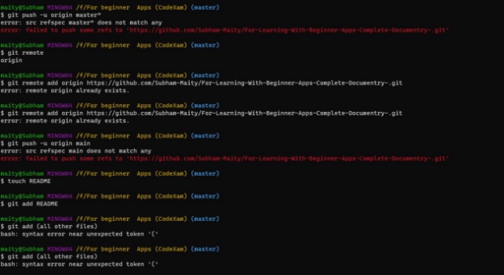

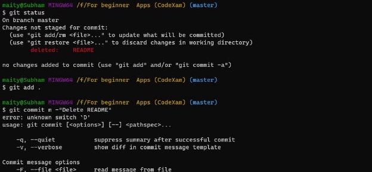


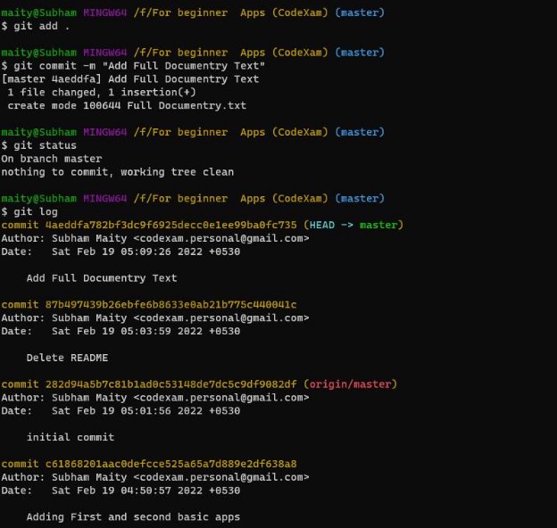

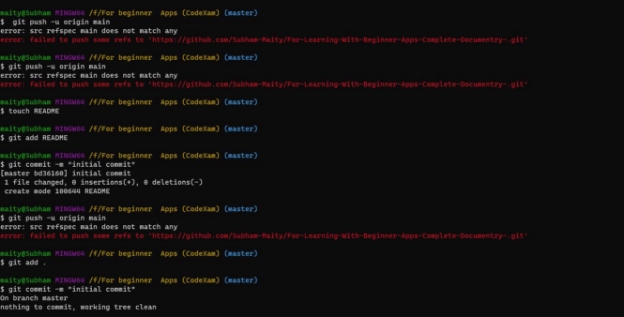

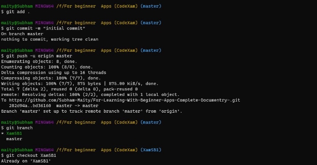


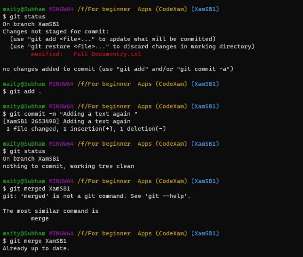

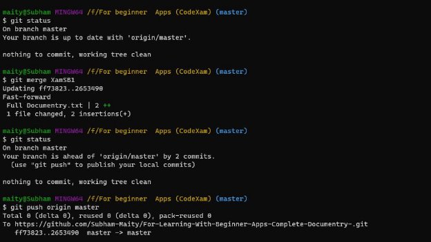

**17.Extra Experience for Master of Git and Terminal**


If you wanna delete any log what should you do ? Let’s make some log first

